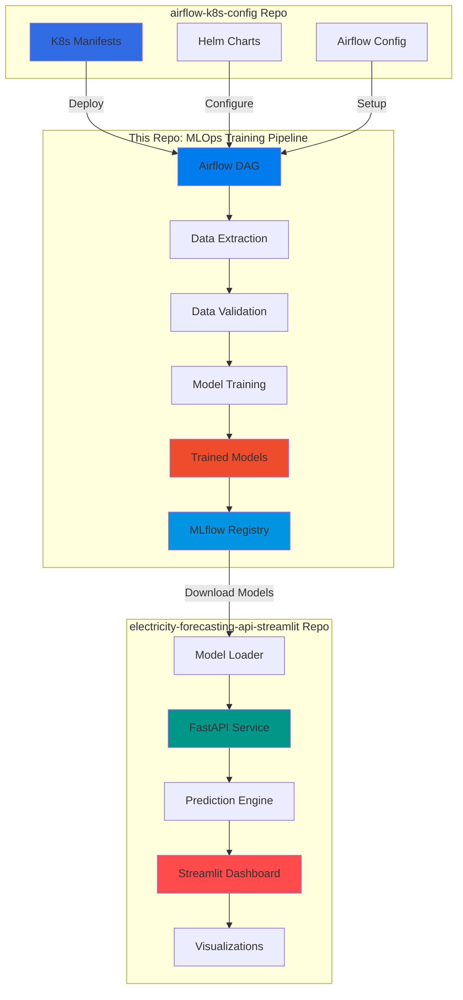
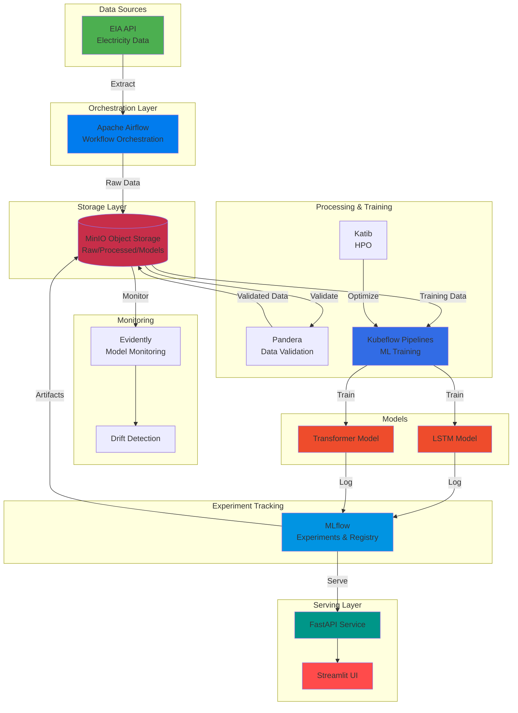
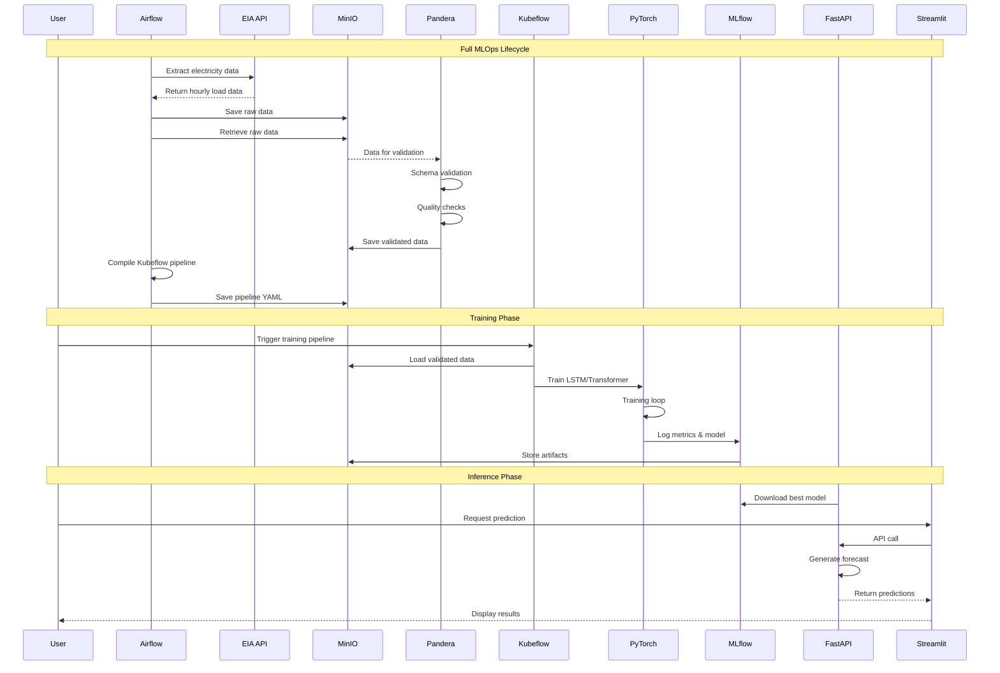
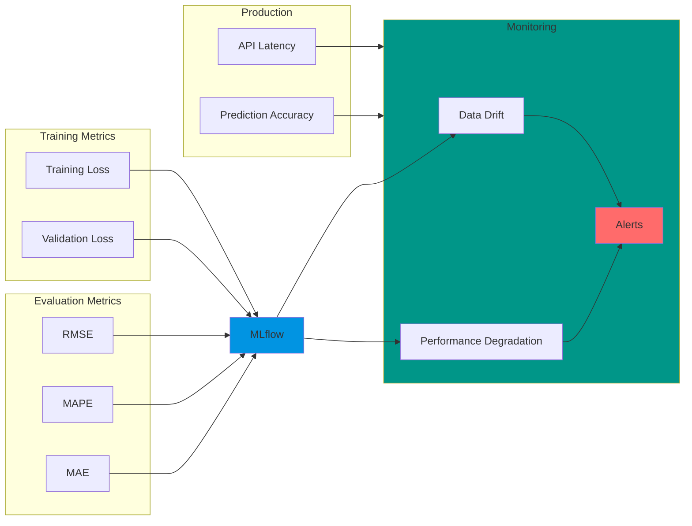

# ⚡ Electricity Load Forecasting - MLOps Pipeline

<div align="center">


**Production-ready MLOps pipeline for electricity load forecasting using deep learning**

[Features](#-features) • [Architecture](#-architecture) • [Quick Start](#-quick-start) • [Documentation](#-documentation)

</div>

---

## 📋 Table of Contents

- [Overview](#-overview)
- [Related Repositories](#-related-repositories)
- [Architecture](#-architecture)
- [Technology Stack](#-technology-stack)
- [Features](#-features)
- [Prerequisites](#-prerequisites)
- [Installation](#-installation)
- [Usage](#-usage)
- [Pipeline Workflow](#-pipeline-workflow)
- [Project Structure](#-project-structure)
- [Configuration](#%EF%B8%8F-configuration)
- [Testing](#-testing)
- [Deployment](#-deployment)
- [Monitoring](#-monitoring)
- [Contributing](#-contributing)
- [License](#-license)

---

## 🎯 Overview

This project implements a complete **MLOps pipeline** for electricity load forecasting using **LSTM** and **Transformer** models. It fetches real-time data from the EIA (U.S. Energy Information Administration) API, validates data quality, trains deep learning models, and tracks experiments with full reproducibility.

### Key Highlights

- 🔄 **Automated Data Pipeline** - Weekly data extraction and validation with Airflow
- 🧠 **Deep Learning Models** - LSTM  architectures for time series forecasting
- 📊 **Experiment Tracking** - MLflow integration for model versioning and metrics
- ☁️ **Cloud-Native** - Kubernetes-based deployment with MinIO object storage
- ✅ **Data Quality** - Pandera-based schema validation and drift detection
- 🔍 **Model Monitoring** - Evidently AI for performance monitoring

---

## 🔗 Related Repositories

This project is part of a complete MLOps ecosystem for electricity load forecasting. Check out these companion repositories:

<div align="center">

| Repository | Description | Technologies | Link |
|------------|-------------|--------------|------|
| **🌐 API & Web Interface** | FastAPI backend + Streamlit dashboard for real-time model inference, predictions visualization, and interactive forecasting |   | [](https://github.com/Saoudyahya/electricity-forecasting-api-streamlit) |
| **⚙️ Airflow K8s Config** | Production-ready Kubernetes manifests, Helm charts, and deployment configurations for Apache Airflow orchestration |   | [](https://github.com/Saoudyahya/airflow-k8s-config) |

</div>

### 🎯 How They Work Together



### 📦 Repository Purposes

| Component | Purpose | When to Use |
|-----------|---------|-------------|
| **This Repository** | Train and validate ML models, orchestrate data pipelines, experiment tracking | Development, model training, hyperparameter tuning |
| **API/Streamlit** | Serve predictions, provide user interface, real-time forecasting | Production inference, end-user access, dashboards |
| **Airflow K8s Config** | Deploy and configure Airflow on Kubernetes | Infrastructure setup, production deployment |

---

## 🏗️ Architecture

### High-Level Architecture



### Technology Stack

<div align="center">

| Component | Technology | Purpose |
|-----------|-----------|---------|
| **Orchestration** |  | Workflow scheduling and data pipeline orchestration |
| **ML Pipelines** |  | Model training and deployment pipelines |
| **Experiment Tracking** |  | Model versioning, metrics tracking, and registry |
| **Object Storage** |  | S3-compatible storage for data and artifacts |
| **Deep Learning** |  | Neural network implementation (LSTM/Transformer) |
| **Data Validation** |  | Schema validation and data quality checks |
| **HPO** |  | Hyperparameter optimization |
| **Monitoring** |  | Model drift detection and performance monitoring |
| **Container Orchestration** |  | Container orchestration and deployment |
| **Data Processing** |  | Data manipulation and analysis |
| **API Service** |  | High-performance API for model serving |
| **Dashboard** |  | Interactive web interface for predictions |

</div>

---

## ✨ Features

### 🔄 Data Pipeline
- **Automated Data Extraction** from EIA API with configurable regions and time ranges
- **Schema Validation** using Pandera with custom business rules
- **Data Quality Checks** including continuity, outlier detection, and missing value analysis
- **Automated Cleanup** of old files to manage storage efficiently

### 🧠 Machine Learning
- **LSTM Architecture** for sequential pattern learning
- **Transformer Architecture** for attention-based forecasting
- **Sequence-to-Sequence** forecasting (168-hour input → 24-hour prediction)
- **Early Stopping** and gradient clipping for stable training
- **Hyperparameter Optimization** with Katib for automated tuning

### 📊 Experiment Management
- **MLflow Integration** for experiment tracking and model registry
- **Automated Logging** of parameters, metrics, and artifacts
- **Model Versioning** with descriptions and metadata
- **MinIO Backend** for scalable artifact storage

### 🎯 Production Ready
- **Kubernetes Native** deployment on any K8s cluster
- **Reproducible Pipelines** with versioned configurations
- **Comprehensive Testing** suite for all components
- **Drift Detection** for model performance monitoring
- **Modular Architecture** for easy extension and maintenance
- **Production Inference** via FastAPI service (see [API repository](https://github.com/Saoudyahya/electricity-forecasting-api-streamlit))

---

## 📦 Prerequisites

### Required
- **Python 3.10+**
- **Kubernetes Cluster** (Minikube, GKE, EKS, or AKS)
- **kubectl** configured for your cluster
- **EIA API Key** - [Register here](https://www.eia.gov/opendata/register.php)

### Kubernetes Services
- Apache Airflow (see [Airflow K8s Config](https://github.com/Saoudyahya/airflow-k8s-config) for deployment)
- Kubeflow Pipelines
- MLflow
- MinIO
- (Optional) Katib for HPO

---

## 🚀 Installation

### 1. Clone Repository

```bash
git clone https://github.com/yourusername/electricity-load-forecasting.git
cd electricity-load-forecasting
```

### 2. Set Up Environment

```bash
# Create virtual environment
python -m venv venv
source venv/bin/activate  # On Windows: venv\Scripts\activate

# Install dependencies
pip install -r requirements.txt
```

### 3. Configure Environment Variables

```bash
# Copy example environment file
cp .example.env .env

# Edit .env and add your EIA API key
# EIA_API_KEY="your-api-key-here"
```

### 4. Update Configuration

Edit `config.yaml` to match your environment:

```yaml
api:
  eia_api_key: "${EIA_API_KEY}"

storage:
  minio_endpoint: "minio.minio.svc.cluster.local:9000"
  minio_access_key: "minioadmin"
  minio_secret_key: "minioadmin"

mlflow:
  tracking_uri: "http://mlflow.mlflow.svc.cluster.local:5000"

kubeflow:
  pipeline_host: "http://ml-pipeline.kubeflow.svc.cluster.local:8888"
```

---

## 🎮 Usage

### Complete Workflow



### Step-by-Step Guide

#### 1. Test Components Locally

```bash
# Test data extraction
python tests/test_extraction.py

# Test data validation
python tests/test_validation.py

# Test model training
python tests/test_model_training.py
```

#### 2. Deploy to Kubernetes

```bash
# Deploy Airflow using the companion repository
# See: https://github.com/Saoudyahya/airflow-k8s-config
git clone https://github.com/Saoudyahya/airflow-k8s-config.git
cd airflow-k8s-config
# Follow deployment instructions

# Deploy Airflow DAG
kubectl cp core/airflow_dag.py airflow-pod:/opt/airflow/dags/

# Verify deployment
kubectl get pods -n airflow
```

#### 3. Trigger Airflow Pipeline

```bash
# Port forward to Airflow UI
kubectl port-forward -n airflow svc/airflow-webserver 8080:8080

# Access UI at http://localhost:8080
# Default credentials: airflow / airflow

# Trigger DAG: electricity_pipeline_preparation
```

#### 4. Monitor Pipeline Progress

The Airflow pipeline will:
1. ✅ Extract data from EIA API → `raw/`
2. ✅ Validate data with Pandera → `processed/`
3. ✅ Generate data quality report → `validation_reports/`
4. ✅ Compile Kubeflow pipeline → `compiled/`
5. ✅ Generate pipeline parameters → `pipeline_parameters/`
6. ✅ Cleanup old files

#### 5. Access MinIO UI

```bash
# Port forward to MinIO console
kubectl port-forward -n minio svc/minio 9001:9001

# Access UI at http://localhost:9001
# Credentials: minioadmin / minioadmin

# Download compiled pipeline YAML from kubeflow-pipelines bucket
```

#### 6. Trigger Kubeflow Training

```bash
# Port forward to Kubeflow UI
kubectl port-forward -n kubeflow svc/ml-pipeline-ui 8080:80

# Access UI at http://localhost:8080

# Steps:
# 1. Upload pipeline YAML from MinIO
# 2. Create new run
# 3. Copy parameters from MinIO: pipeline_parameters/parameters_*.json
# 4. Start run
```

#### 7. Monitor Training in MLflow

```bash
# Port forward to MLflow UI
kubectl port-forward -n mlflow svc/mlflow 5000:5000

# Access UI at http://localhost:5000

# View:
# - Experiments
# - Metrics (RMSE, MAPE)
# - Model artifacts
# - Model registry
```

#### 8. Deploy Inference API (Optional)

```bash
# Clone the API repository
git clone https://github.com/Saoudyahya/electricity-forecasting-api-streamlit.git
cd electricity-forecasting-api-streamlit

# Follow deployment instructions in that repository
# The API will automatically fetch models from MLflow
```

---

## 📁 Project Structure

```
electricity-load-forecasting/
├── 📄 README.md                 # This file
├── 📄 requirements.txt          # Python dependencies
├── 📄 config.yaml              # Main configuration
├── 📄 .example.env             # Environment variables template
├── 📄 .gitignore               # Git ignore rules
│
├── 📁 core/                    # Core pipeline components
│   ├── 📄 airflow_dag.py       # Airflow DAG definition
│   ├── 📄 data_extraction.py   # EIA API data extractor
│   ├── 📄 data_validation.py   # Pandera validation schemas
│   ├── 📄 kubeflow_pipeline.py # Kubeflow training pipeline
│   ├── 📄 model.py             # PyTorch LSTM/Transformer models
│   └── 📄 train_katib.py       # Katib HPO training script
│
└── 📁 tests/                   # Test suite
    ├── 📄 test_extraction.py    # Data extraction tests
    ├── 📄 test_validation.py    # Data validation tests
    └── 📄 test_model_training.py # Model training tests
```

### Related Repositories Structure

```
📦 Complete MLOps Ecosystem
├── 📁 electricity-load-forecasting/          # This repository (Training Pipeline)
├── 📁 electricity-forecasting-api-streamlit/ # Inference & UI
│   ├── 📁 api/                               # FastAPI service
│   ├── 📁 streamlit/                         # Web dashboard
│   └── 📁 models/                            # Model serving logic
└── 📁 airflow-k8s-config/                    # Infrastructure
    ├── 📁 helm/                              # Helm charts
    ├── 📁 manifests/                         # K8s manifests
    └── 📁 configs/                           # Airflow configurations
```

---

## ⚙️ Configuration

### config.yaml Structure

```yaml
api:
  eia_api_key: "${EIA_API_KEY}"
  eia_base_url: "https://api.eia.gov/v2"
  endpoint: "/electricity/rto/region-data/data/"

storage:
  minio_endpoint: "minio.minio.svc.cluster.local:9000"
  bucket_name: "electricity-data"
  raw_data_prefix: "raw/"
  processed_data_prefix: "processed/"
  pipeline_bucket: "kubeflow-pipelines"

mlflow:
  tracking_uri: "http://mlflow.mlflow.svc.cluster.local:5000"
  experiment_name: "electricity-load-forecasting"

model:
  sequence_length: 168      # 7 days of hourly data
  prediction_horizon: 24    # Predict next 24 hours
  hidden_size: 128
  num_layers: 2
  dropout: 0.2
  learning_rate: 0.001
  batch_size: 32
  epochs: 50

validation:
  train_split: 0.7
  val_split: 0.15
  test_split: 0.15

drift_detection:
  reference_window_days: 30
  current_window_days: 7
  drift_threshold: 0.1
```

---

## 🧪 Testing

### Local Testing

```bash
# Run all tests in sequence
cd tests

# 1. Test data extraction
python test_extraction.py
# Output: electricity_data.csv

# 2. Test data validation
python test_validation.py
# Output: validated_data.csv, validation_report.json

# 3. Test model training
python test_model_training.py
# Output: best_model.pt, sample_predictions.csv
```

### Expected Output

```bash
✅ Test Extraction: PASSED
   - 2,160 records extracted
   - 10 regions
   - Date range: 2024-10-01 to 2024-12-30

✅ Test Validation: PASSED
   - Schema validation: VALID
   - 0 errors, 2 warnings
   - Outliers: 1.2%

✅ Test Training: PASSED
   - Model trained: 10 epochs
   - Test RMSE: 1234.56 MW
   - Test MAPE: 3.45%
   - Model saved successfully
```

---

## 🚢 Deployment

### Kubernetes Deployment

#### 1. Deploy MinIO

```bash
kubectl create namespace minio
kubectl apply -f k8s/minio-deployment.yaml
```

#### 2. Deploy MLflow

```bash
kubectl create namespace mlflow
kubectl apply -f k8s/mlflow-deployment.yaml
```

#### 3. Deploy Airflow

For production-ready Airflow deployment, use the companion repository:

```bash
# Clone the Airflow configuration repository
git clone https://github.com/Saoudyahya/airflow-k8s-config.git
cd airflow-k8s-config

# Follow the deployment guide in that repository
# It includes production-ready Helm values and K8s manifests
```

Or deploy with Helm directly:

```bash
kubectl create namespace airflow
helm install airflow apache-airflow/airflow -n airflow
```

#### 4. Deploy Kubeflow Pipelines

```bash
export PIPELINE_VERSION=2.0.0
kubectl apply -k "github.com/kubeflow/pipelines/manifests/kustomize/cluster-scoped-resources?ref=$PIPELINE_VERSION"
kubectl wait --for condition=established --timeout=60s crd/applications.app.k8s.io
kubectl apply -k "github.com/kubeflow/pipelines/manifests/kustomize/env/platform-agnostic?ref=$PIPELINE_VERSION"
```

#### 5. Deploy Inference API (Optional)

```bash
# See the API repository for deployment instructions
# https://github.com/Saoudyahya/electricity-forecasting-api-streamlit
```

### Docker Images

Build custom images for components:

```bash
# Build Airflow DAG image
docker build -t your-registry/electricity-airflow:latest -f docker/Dockerfile.airflow .

# Build Kubeflow component image
docker build -t your-registry/electricity-training:latest -f docker/Dockerfile.training .

# Push to registry
docker push your-registry/electricity-airflow:latest
docker push your-registry/electricity-training:latest
```

---

## 📊 Monitoring

### Model Performance Metrics



### Key Metrics

| Metric | Description | Target | Monitored In |
|--------|-------------|--------|--------------|
| **RMSE** | Root Mean Squared Error | < 2000 MW | MLflow |
| **MAPE** | Mean Absolute Percentage Error | < 5% | MLflow |
| **Training Time** | Time to train model | < 30 min | Kubeflow |
| **Data Freshness** | Age of training data | < 7 days | Airflow |
| **Model Drift** | Distribution shift detection | < 0.1 | Evidently |
| **API Latency** | Inference response time | < 100ms | FastAPI |
| **Prediction Throughput** | Predictions per second | > 100 | FastAPI |

### Access Monitoring Dashboards

```bash
# MLflow UI
kubectl port-forward -n mlflow svc/mlflow 5000:5000
# → http://localhost:5000

# Airflow UI
kubectl port-forward -n airflow svc/airflow-webserver 8080:8080
# → http://localhost:8080

# Kubeflow UI
kubectl port-forward -n kubeflow svc/ml-pipeline-ui 8080:80
# → http://localhost:8080

# MinIO Console
kubectl port-forward -n minio svc/minio 9001:9001
# → http://localhost:9001

# Streamlit Dashboard (if deployed)
# See: https://github.com/Saoudyahya/electricity-forecasting-api-streamlit
kubectl port-forward -n inference svc/streamlit 8501:8501
# → http://localhost:8501
```

---

## 🔧 Troubleshooting

### Common Issues

#### Issue: EIA API Rate Limit

```bash
Error: Too many requests
Solution: Wait 60 seconds or reduce data fetch frequency
```

#### Issue: MinIO Connection Failed

```bash
# Check MinIO is running
kubectl get pods -n minio

# Check service
kubectl get svc -n minio

# Test connection
kubectl port-forward -n minio svc/minio 9000:9000
```

#### Issue: Kubeflow Pipeline Compilation Failed

```bash
# Check Python environment
pip list | grep kfp

# Reinstall KFP
pip install --upgrade kfp

# Recompile
python core/kubeflow_pipeline.py
```

#### Issue: Model Training OOM (Out of Memory)

```python
# Reduce batch size in config.yaml
model:
  batch_size: 16  # from 32
  
# Or reduce model size
model:
  hidden_size: 64  # from 128
```

#### Issue: Airflow DAG Not Appearing

```bash
# Check if DAG file is in correct location
kubectl exec -n airflow airflow-scheduler-0 -- ls /opt/airflow/dags/

# Check DAG for syntax errors
kubectl exec -n airflow airflow-scheduler-0 -- python /opt/airflow/dags/airflow_dag.py

# For more detailed Airflow troubleshooting, see:
# https://github.com/Saoudyahya/airflow-k8s-config
```

#### Issue: API Service Not Connecting to MLflow

```bash
# Verify MLflow endpoint
kubectl get svc -n mlflow

# Test connection from API pod
kubectl exec -n inference api-pod -- curl http://mlflow.mlflow.svc.cluster.local:5000/health

# For API-specific issues, see:
# https://github.com/Saoudyahya/electricity-forecasting-api-streamlit
```

---

## 🤝 Contributing

Contributions are welcome! Please follow these guidelines:

1. **Fork** the repository
2. **Create** a feature branch (`git checkout -b feature/amazing-feature`)
3. **Commit** your changes (`git commit -m 'Add amazing feature'`)
4. **Push** to the branch (`git push origin feature/amazing-feature`)
5. **Open** a Pull Request

### Development Guidelines

- Follow PEP 8 style guide
- Add unit tests for new features
- Update documentation
- Ensure all tests pass
- Add type hints to functions

### Multi-Repository Contributions

If your contribution spans multiple repositories:
1. Create PRs in all affected repositories
2. Link the PRs together in the description
3. Ensure compatibility across repositories

---

## 📄 License

This project is licensed under the MIT License - see the [LICENSE](LICENSE) file for details.

---

## 🙏 Acknowledgments

- **EIA** for providing open electricity data API
- **Kubeflow** community for ML pipeline tools
- **MLflow** team for experiment tracking framework
- **Apache Airflow** for workflow orchestration
- **PyTorch** team for deep learning framework
- **FastAPI** and **Streamlit** teams for inference infrastructure

---

## 📞 Contact & Support

### This Repository
- **Issues**: [GitHub Issues](https://github.com/yourusername/electricity-load-forecasting/issues)
- **Discussions**: [GitHub Discussions](https://github.com/yourusername/electricity-load-forecasting/discussions)

### Related Repositories
- **API/Streamlit Issues**: [Report here](https://github.com/Saoudyahya/electricity-forecasting-api-streamlit/issues)
- **Airflow Config Issues**: [Report here](https://github.com/Saoudyahya/airflow-k8s-config/issues)

### General
- **Email**: your.email@example.com

---

## 🗺️ Roadmap

### Current Features ✅
- [x] EIA API data extraction
- [x] Pandera data validation
- [x] LSTM and Transformer models
- [x] MLflow experiment tracking
- [x] Kubeflow pipeline orchestration
- [x] Airflow workflow automation
- [x] FastAPI inference service
- [x] Streamlit dashboard

### Upcoming Features 🚀
- [ ] Real-time streaming predictions
- [ ] Multi-region forecasting
- [ ] Advanced feature engineering
- [ ] Ensemble model support
- [ ] A/B testing framework
- [ ] Automated model retraining
- [ ] Performance benchmarking
- [ ] GraphQL API support

---

<div align="center">

**⚡ Built with ❤️ for reliable electricity load forecasting**


### 🔗 Project Ecosystem

[](https://github.com/yourusername/electricity-load-forecasting)
[](https://github.com/Saoudyahya/electricity-forecasting-api-streamlit)
[](https://github.com/Saoudyahya/airflow-k8s-config)

</div>

